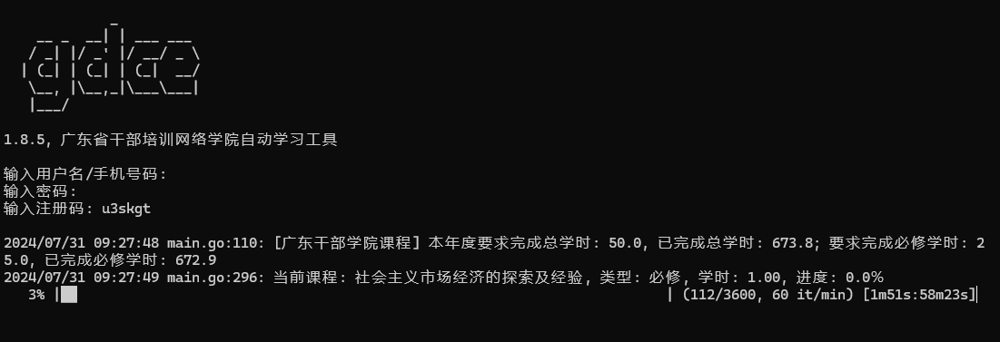
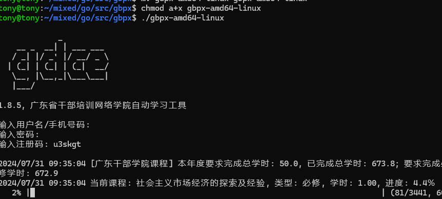
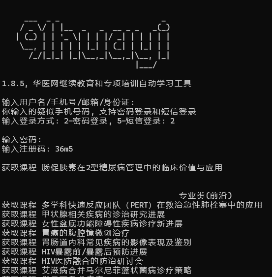
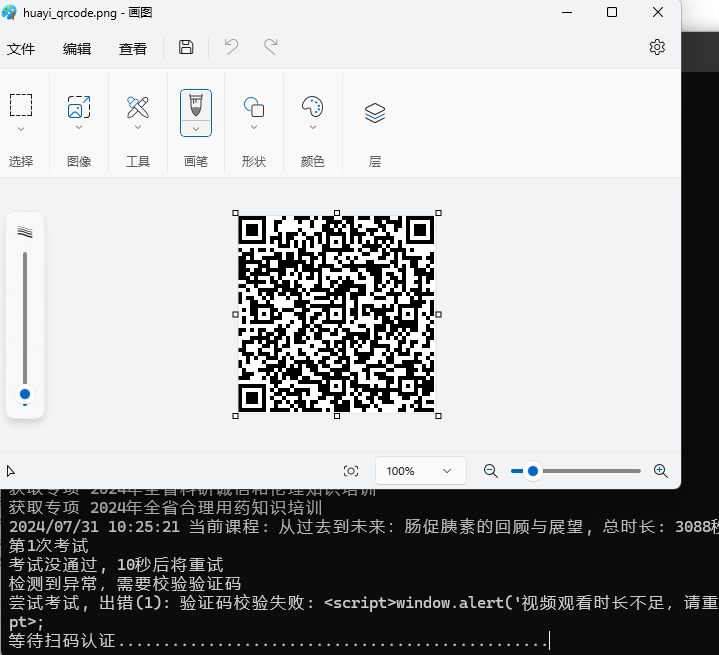

# gbpx

> 全国省级平台网络学院 + 行业继续教育 自动学习工具集合。

当前已完整支持挂课的国家级/省级平台：中网院、广东、重庆、陕西、江西、河北、青海；

当前已经实现模拟登录逻辑的省级平台有：海南、广西、福建、安徽、浙江、上海、湖南、湖北、江苏、云南、贵州、四川、河南、山东、山西、内蒙古、宁夏、甘肃、天津、北京、辽宁、吉林、黑龙江、新疆；

当前已实现模拟登录逻辑的地市级平台有：广州、深圳、珠海、东莞、江门、杭州、宁波、舟山；

当前已完整支持的行业继续教育平台有：华医网；

当前已实现模拟登录逻辑的行业继续教育平台有：湖南人才市场公共教育网；


## 已完整支持挂课平台

### 中网院

功能说明：1、党校分院未完成课程+未完成专题班自动挂机学习；2、浦东分院专题自动学习；3、企业分院 我的在线自学+已报名专栏/专题班 自动挂机学习；

### 广东网络学院

功能说明：支持自动选课+在学课程/专题的自动学习，也支持同步登录中网院进行课程学习(功能同中网院版本，此模块需开发者在后台开通)。

### 重庆网络学院

功能说明：全自动选课/挂课/考试。

### 陕西网络学院

功能说明：用户先手动选课，然后程序会自动挂机已选的课。

### 江西网络学院

功能说明：支持自动选课年度指定必修课，自动挂课未完成课程/专题班，其余课程需要先手动选课。

### 河北网络学院

功能说明：支持自动选课年度指定必修课，自动挂课未完成课程/专题班，其余课程需要先手动选课。（分两种模式：1、默认模式，速度和手工看一样；2、加速模式，几十秒看完视频）

### 青海网络学院

功能说明：支持“我的课程-未完成课程” + “我的专题班-未完成专题班”的自动挂机学习，其余课程需要用户手动选课。

### 华医网 

功能说明：自动学习专项培训，按项目级别/项目类型要求学时配置自动选课，如果课件需要扫码认证，则会弹出二维码窗口，用户扫完关掉即可。视频完成后，自动进行考试。

首次启动后，会在程序目录生产一个 **.91huayi.json** 的配置文件，其中 **speed_rate** 项用于配置视频倍速，可选300的整数倍(因为系统300秒提交一次学习进度)，如1、2、3、4、5、6、10、12、15、20、25等，默认为2。 

**huayi_config** 项用于配置子域名(sub_domain)、自动选课学时(scores_required)要求。

**huayi_config.sub_domain**: 该项目会在首次启动时提醒配置，请配置成你所在地区的子域名前缀，例如 cme1、cme2、...、cme45，如果你不知道该配置成哪个，只需要在浏览器登录你的账号，点击进入个人中心，看看浏览器地址栏是用了哪个子域名，填这个即可。

**huayi_config.scores_required**: 该项目用于配置按项目级别(国家级/省级/市级/区县级)和项目类型(专业类三个类别/公需类)要求的学时自动选课，默认值都是0，表示不会自动选这个项目级别/项目类型的课。

```
"guojia": 0,  // 国家级
"sheng": 0,  // 省级
"shi": 0,  // 市级
"quxian": 0,  // 区县级
"zy_jichu": 0, // 专业类（基础）
"zy_tigao": 0, // 专业类（提高）
"zy_qianyan": 0,  // 专业类（前沿）
"gongxu": 0,  // 公需类
```


## 运行效果图

### 广东干部培训 windows 客户端运行效果




### 广东干部培训 linux 客户端运行效果




### 华医网 windows客户端运行效果






## 关于注册码

是的，注册码通过需要打赏(付费)开发者来获取，最低不少于20元，使用期限为当前年度，过期可续。如果你觉得不值得，可以右上角关掉本页面。本程序最开始是免费使用的，开发者花了大量时间去适配，解决各种问题。后来迫于服务器续费压力，开始尝试收费。有被人喷过不开源不免费，首先这种工具开源传播会带来一些不必要的麻烦，最后可能下架，不如一开始就不开源了。其次，收费是为了更好地服务。为爱发电不长久，有正反馈才更有动力持续去做这件事。

